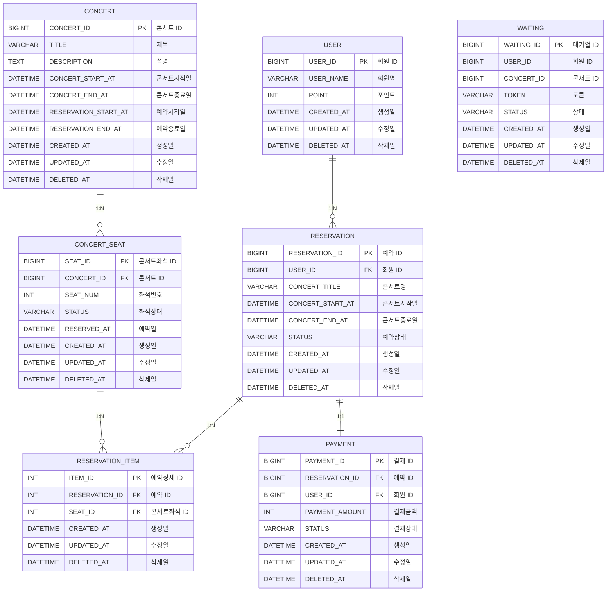

## ERD

```mermaid
erDiagram
    USER {
        BIGINT USER_ID PK "회원 ID"
        VARCHAR USER_NAME "회원명"
        INT POINT "포인트"
        DATETIME CREATED_AT "생성일"
        DATETIME UPDATED_AT "수정일"
        DATETIME DELETED_AT "삭제일"
    }


    CONCERT {
        BIGINT CONCERT_ID PK "콘서트 ID"
        VARCHAR TITLE "제목"
        TEXT DESCRIPTION "설명"
        DATETIME CONCERT_START_AT "콘서트시작일"
        DATETIME CONCERT_END_AT "콘서트종료일"
        DATETIME RESERVATION_START_AT "예약시작일"
        DATETIME RESERVATION_END_AT "예약종료일"
        DATETIME CREATED_AT "생성일"
        DATETIME UPDATED_AT "수정일"
        DATETIME DELETED_AT "삭제일"
    }

    CONCERT_SEAT {
        BIGINT SEAT_ID PK "콘서트좌석 ID"
        BIGINT CONCERT_ID FK "콘서트 ID"
        INT SEAT_NUM "좌석번호"
        VARCHAR STATUS "좌석상태"
        DATETIME RESERVED_AT "예약일"
        DATETIME CREATED_AT "생성일"
        DATETIME UPDATED_AT "수정일"
        DATETIME DELETED_AT "삭제일"
    }

    RESERVATION {
        BIGINT RESERVATION_ID PK "예약 ID"
        BIGINT USER_ID FK "회원 ID"
        VARCHAR CONCERT_TITLE "콘서트명"
        DATETIME CONCERT_START_AT "콘서트시작일"
        DATETIME CONCERT_END_AT "콘서트종료일"
        VARCHAR STATUS "예약상태"
        DATETIME CREATED_AT "생성일"
        DATETIME UPDATED_AT "수정일"
        DATETIME DELETED_AT "삭제일"
    }

    RESERVATION_ITEM {
        INT ITEM_ID PK "예약상세 ID"
        INT RESERVATION_ID FK "예약 ID"
        INT SEAT_ID FK "콘서트좌석 ID"
        DATETIME CREATED_AT "생성일"
        DATETIME UPDATED_AT "수정일"
        DATETIME DELETED_AT "삭제일"
    }

    PAYMENT {
        BIGINT PAYMENT_ID PK "결제 ID"
        BIGINT RESERVATION_ID FK "예약 ID"
        BIGINT USER_ID FK "회원 ID"
        INT PAYMENT_AMOUNT "결제금액"
        VARCHAR STATUS "결제상태"
        DATETIME CREATED_AT "생성일"
        DATETIME UPDATED_AT "수정일"
        DATETIME DELETED_AT "삭제일"
    }

    WAITING {
        BIGINT WAITING_ID PK "대기열 ID"
        BIGINT USER_ID "회원 ID"
        BIGINT CONCERT_ID "콘서트 ID"
        VARCHAR TOKEN "토큰"
        VARCHAR STATUS "상태"
        DATETIME CREATED_AT "생성일"
        DATETIME UPDATED_AT "수정일"
        DATETIME DELETED_AT "삭제일"
    }

    USER ||--o{ RESERVATION : "1:N"
    RESERVATION ||--o{ RESERVATION_ITEM : "1:N"
    RESERVATION ||--|| PAYMENT : "1:1"
    CONCERT ||--o{ CONCERT_SEAT : "1:N"
    CONCERT_SEAT ||--o{ RESERVATION_ITEM : "1:N"
```
